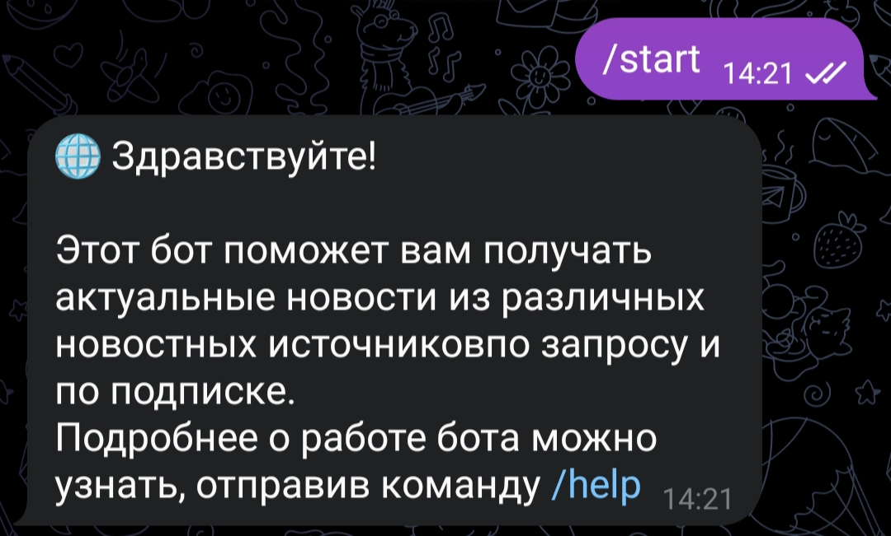
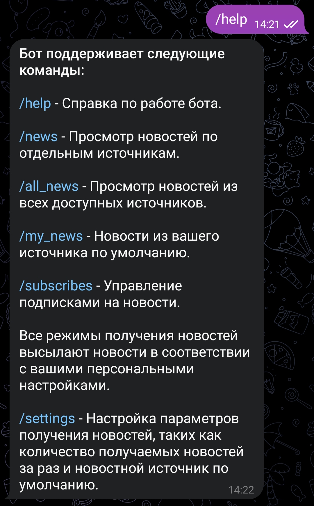
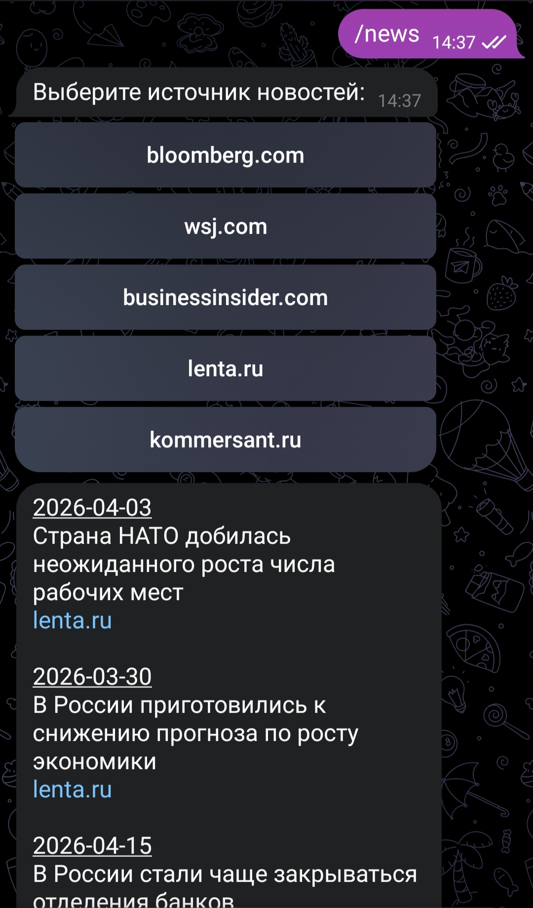
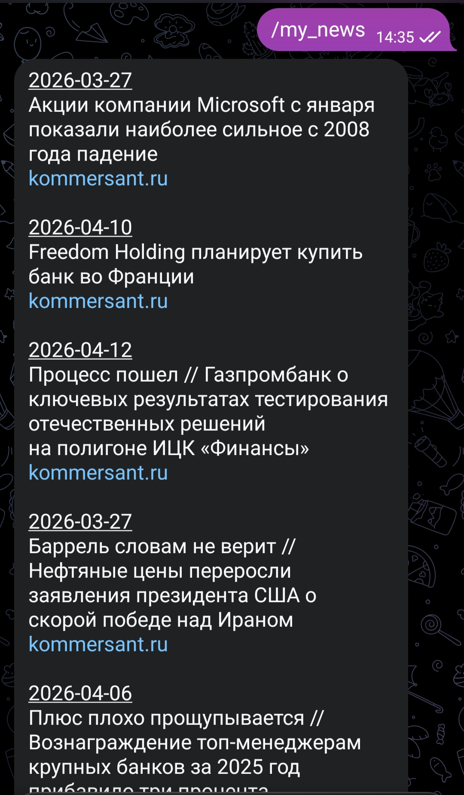
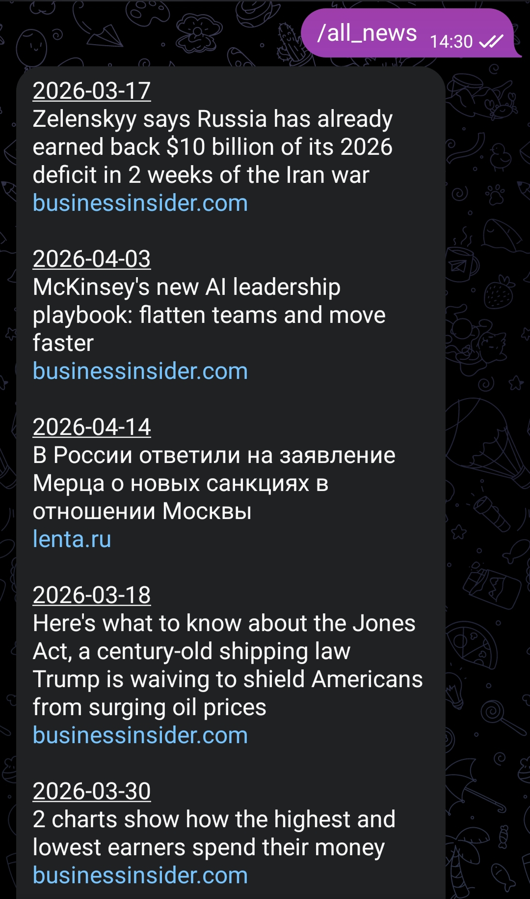
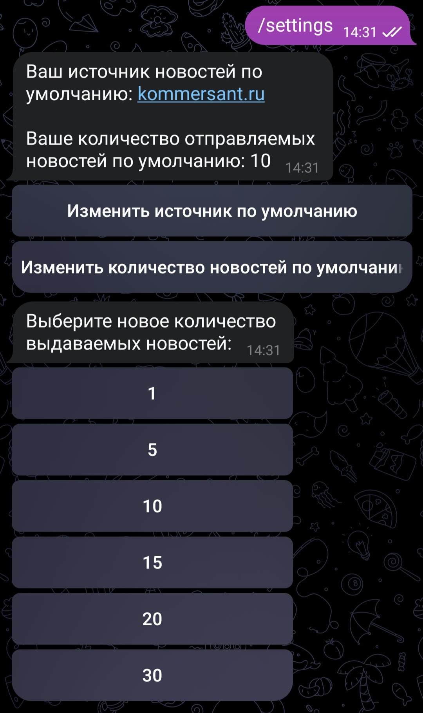
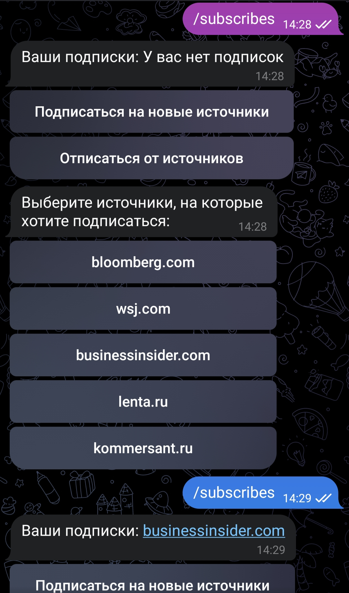
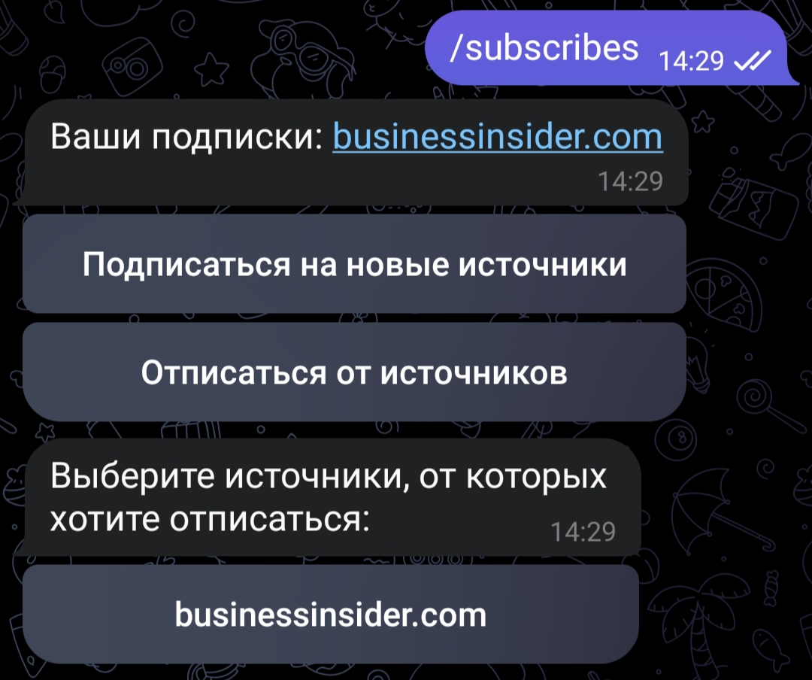
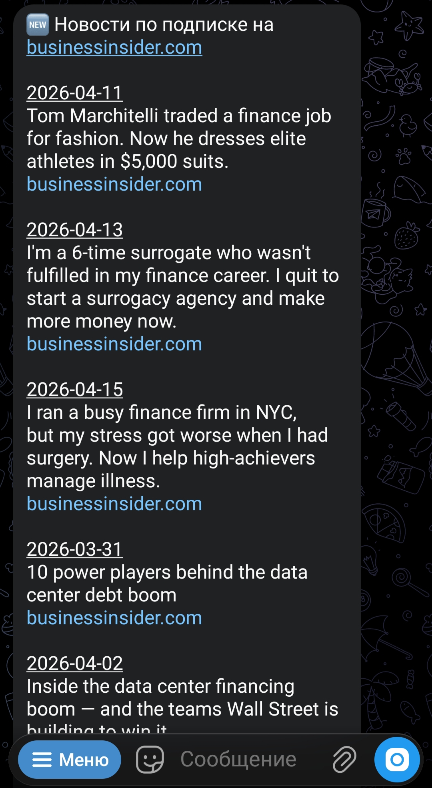

# Telegram-бот NewsBot

Pet-проект telegram-бота для получения новостей из различных источников, на данный момент поддерживает: bloomberg.com, kommersant.ru, lenta.ru, wsj.com, businessinsider.com

Не предназначен для production-использования, но может быть полезен как пример кода.

## Функционал

- /help - Справка по работе бота. 
- /news - Просмотр новостей по отдельным источникам.
- /all_news - Просмотр новостей из всех доступных источников. 
- /my_news - Новости из вашего источника по умолчанию. 
- /subscribes - Управление подписками на новости.
Все режимы получения новостей высылают новости в соответствии с персональными настройками пользователя. 
- /settings - Настройка параметров получения новостей, таких как количество получаемых новостей за раз и новостной источник по умолчанию.

## Технологии

- Python 3.13
- Aiogram 3.27.0 
- Alembic 1.18.4
- SQLAlchemy 2.0.49
- APScheduler 3.11.2
- PostgreSQL
- Docker/Docker Compose

## Схема базы данных

Полная схема PostgreSQL описана в файле [schema.sql](schema.sql).

## Переменные окружения

Создайте файл .env в корне проекта, структура представлена в файле .env_example:

```bash
# Bot
BOT_TOKEN=your_bot_token

# PostgreSQL
POSTGRES_DB=db_name
POSTGRES_HOST=localhost
POSTGRES_PORT=5432
POSTGRES_USER=username
POSTGRES_PASSWORD=your_password

# NewsAPI
NEWSAPI_KEY=your_api_key
```

## Как запустить

```bash
# Клонировать репозиторий
git clone ...
cd NewsBot

# Создать виртуальное окружение
python -m venv venv
source venv/bin/activate  # или venv\Scripts\activate на Windows

# Запускаем Postgres
docker compose up -d postgres

# Применяем миграции
docker compose run --rm bot alembic upgrade head

# Запускаем бота - он автоматически соберется из Dockerfile
docker compose up -d bot
```

## Скриншоты










## Статус проекта

Завершен

## Автор
Кузнецова Юлия / https://github.com/juliamayorrr
